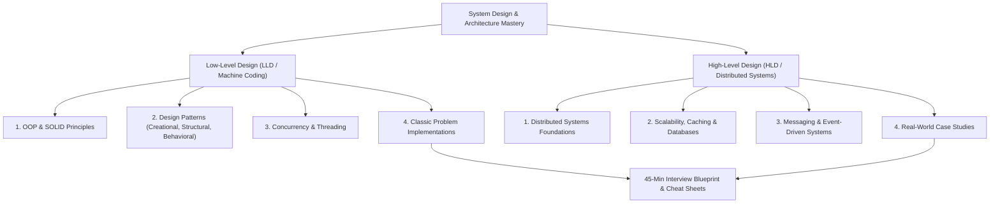

# 🚀 Low-Level Design (LLD) & High-Level Design (HLD) Mastery

> A battle-tested, structured handbook and tutorial covering Object-Oriented Design (LLD/Machine Coding) and Distributed Systems Architecture (HLD) for top-tier software engineering interviews and real-world system building.

---

## 🗺️ Master Curriculum Roadmap

---

## 📑 Repository Structure & Table of Contents

### 🎯 [Interview Framework & Cheat Sheet](interview-framework.md)
* [45-Minute Interview Strategy](interview-framework.md#45-minute-interview-blueprint)
* [LLD 5-Step Execution Plan](interview-framework.md#part-1-lld--machine-coding-framework)
* [HLD 5-Step Execution Plan](interview-framework.md#part-2-hld--system-design-framework)
* [Latency Numbers Every Engineer Must Know](interview-framework.md#latency-numbers-every-programmer-should-know)
* [Back-of-the-Envelope Capacity Calculations](interview-framework.md#storage--data-sizing-multipliers)

---

### 🧩 Part 1: Low-Level Design (LLD) & Machine Coding

| Module | Description | Guide |
|---|---|---|
| **01. SOLID & OOP** | Core OOP pillars, SRP, OCP, LSP, ISP, DIP with code examples & refactoring patterns. | [solid-principles.md](lld/01-solid-and-oop/solid-principles.md) |
| **02. Creational Patterns** | Singleton (thread-safe double check), Factory, Abstract Factory, Builder, Prototype. | [creational.md](lld/02-design-patterns/creational.md) |
| **02. Structural Patterns** | Adapter, Decorator, Facade, Proxy, Composite with practical real-world usages. | `lld/02-design-patterns/structural.md` *(coming next)* |
| **02. Behavioral Patterns** | Strategy, Observer, State, Chain of Responsibility, Command. | `lld/02-design-patterns/behavioral.md` *(coming next)* |
| **03. Concurrency Patterns** | Locks, Mutex, Semaphores, Deadlock prevention, Producer-Consumer, Thread Pools. | `lld/03-concurrency/concurrency-patterns.md` *(coming next)* |
| **04. Machine Coding Problems** | Parking Lot, Rate Limiter, LRU Cache, Splitwise, Elevator System, Tic-Tac-Toe. | `lld/04-problems/` *(coming next)* |

---

### 🌐 Part 2: High-Level Design (HLD) & Distributed Systems

| Module | Key Architectural Concepts Covered |
|---|---|
| **01. Foundations** | Scalability (Vertical vs Horizontal), Stateless vs Stateful, Load Balancing, Consistent Hashing. |
| **02. Caching Deep-Dive** | Cache-Aside, Write-Through, Write-Back, Eviction (LRU/LFU), Thundering Herd mitigation. |
| **03. Databases & Storage** | Relational vs NoSQL, Indexing (B-Tree vs LSM), Sharding, Replication, CAP & PACELC theorems. |
| **04. Networking & Protocols** | HTTP/1.1 vs HTTP/2 vs HTTP/3, WebSockets, gRPC, Long Polling, TCP vs UDP. |
| **05. Asynchronous & Messaging** | Message Brokers (Kafka, RabbitMQ), Event-driven architecture, Saga pattern for distributed transactions. |
| **06. System Case Studies** | TinyURL, Distributed Rate Limiter, WhatsApp/Slack Chat, Netflix Video Streaming, Uber Ride-Sharing. |

---

## ⚡ Quick Start: How to Use This Repository

1. **For Interview Prep**:
   - Begin with the [Interview Blueprint & Cheat Sheet](interview-framework.md) to understand time pacing and back-of-the-envelope estimation.
   - Master the [SOLID Principles](lld/01-solid-and-oop/solid-principles.md) and [Design Patterns](lld/02-design-patterns/creational.md).
   - Trace through problem designs and practice writing clean, testable object models.
2. **For Day-to-Day Architecture**:
   - Reference patterns for decoupling systems, writing extensible code, and designing fault-tolerant services.

---

## 🤝 Contributing
Contributions are warmly welcomed! Please feel free to open issues or submit pull requests for new problem designs, clarifications, or diagrams.

## 📄 License
This repository is open-sourced under the [MIT License](LICENSE).
