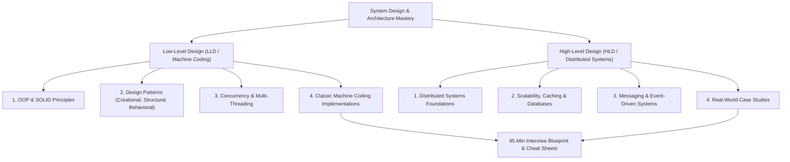

# 🚀 Low-Level Design (LLD) & High-Level Design (HLD) Mastery

> A battle-tested, structured handbook and tutorial covering Object-Oriented Design (LLD / Machine Coding) and Distributed Systems Architecture (HLD) for top-tier software engineering interviews and real-world system building.

---

## 🗺️ Master Curriculum Roadmap

---

## 📑 Repository Structure & Table of Contents

### 🎯 [Interview Framework & Cheat Sheet](interview-framework.md)
* [45-Minute Interview Strategy (LLD & HLD)](interview-framework.md#45-minute-interview-blueprint)
* [LLD 5-Step Execution Plan](interview-framework.md#part-1-lld--machine-coding-framework)
* [HLD 5-Step Execution Plan](interview-framework.md#part-2-hld--system-design-framework)
* [Latency Numbers Every Engineer Must Know](interview-framework.md#latency-numbers-every-programmer-should-know)
* [Back-of-the-Envelope Capacity Calculations](interview-framework.md#storage--data-sizing-multipliers)
* [Common Interview Anti-Patterns to Avoid](interview-framework.md#common-interview-anti-patterns)

---

### 🧩 Part 1: Low-Level Design (LLD) & Machine Coding

#### 1. Core Principles & Patterns
| Module | Description | Guide |
|---|---|---|
| **01. SOLID & Modern OOP** | SRP, OCP, LSP, ISP, DIP with code examples, anti-patterns & refactorings. | [solid-principles.md](lld/01-solid-and-oop/solid-principles.md) |
| **02. Creational Patterns** | Singleton (thread-safe double check), Factory, Abstract Factory, Builder, Prototype. | [creational.md](lld/02-design-patterns/creational.md) |
| **03. Structural Patterns** | Adapter, Decorator, Facade, Proxy, Composite with practical real-world usages. | [structural.md](lld/02-design-patterns/structural.md) |
| **04. Behavioral Patterns** | Strategy, Observer, State, Chain of Responsibility, Command. | [behavioral.md](lld/02-design-patterns/behavioral.md) |
| **05. Concurrency Patterns** | Mutex, Semaphores, RWLocks, Deadlock prevention (Coffman), Thread-Safe Producer-Consumer, Thread Pool. | [concurrency-patterns.md](lld/03-concurrency/concurrency-patterns.md) |

#### 2. Classic Machine Coding Problems
| Problem | Key Concepts / Patterns Applied | Guide |
|---|---|---|
| **01. Multi-Floor Parking Lot** | Strategy (Dynamic Pricing), Factory, Thread safety, Multi-tier vehicle allocation. | [01-parking-lot.md](lld/04-problems/01-parking-lot.md) |
| **02. Rate Limiter Algorithms** | Token Bucket, Leaky Bucket, Sliding Window Log & Sliding Window Counter. | [02-rate-limiter.md](lld/04-problems/02-rate-limiter.md) |
| **03. LRU Cache ($O(1)$)** | Hash Map + Doubly Linked List, Dummy Sentinels, Thread-safe eviction. | [03-lru-cache.md](lld/04-problems/03-lru-cache.md) |
| **04. Splitwise (Expense Sharing)** | Equal, Exact, Percent splits, Balance sheets, Greedy Debt Simplification. | [04-splitwise.md](lld/04-problems/04-splitwise.md) |
| **05. Elevator System** | LOOK / SCAN Dispatching algorithm, State Machine, Multi-car Controller. | [05-elevator-system.md](lld/04-problems/05-elevator-system.md) |
| **06. Tic-Tac-Toe Game** | $N \times N$ Modular Board, Extensible Players, $O(1)$ Win evaluation. | [06-tic-tac-toe.md](lld/04-problems/06-tic-tac-toe.md) |

---

### 🌐 Part 2: High-Level Design (HLD) & Distributed Systems

#### 1. Distributed Systems Foundations
| Topic | Core Concepts Covered | Guide |
|---|---|---|
| **01. Scalability & Availability** | Vertical vs. Horizontal, Stateless vs. Stateful, Active-Active HA, SLAs/SLOs/SLIs. | [01-scalability-and-availability.md](hld/01-foundations/01-scalability-and-availability.md) |
| **02. Caching Strategies** | Cache-Aside, Write-Through, Write-Back, Cache Stampede, Avalanche & Penetration. | [02-caching-strategies.md](hld/01-foundations/02-caching-strategies.md) |
| **03. Databases & Storage** | SQL vs NoSQL, B+ Tree vs LSM Tree, Sharding, Replication, CAP & PACELC. | [03-databases-and-storage.md](hld/01-foundations/03-databases-and-storage.md) |
| **04. Networking & Proxies** | HTTP/1.1 vs HTTP/2 vs HTTP/3, WebSockets, gRPC, Layer 4 vs Layer 7 LBs, Consistent Hashing. | [04-networking-and-proxies.md](hld/01-foundations/04-networking-and-proxies.md) |
| **05. Message Queues & Events** | RabbitMQ vs Kafka, Partitions, Consumer Groups, 2PC vs Saga Pattern (Orchestration & Choreography). | [05-message-queues-and-events.md](hld/01-foundations/05-message-queues-and-events.md) |

#### 2. Real-World System Architectures
| System Design Case Study | Architectural Highlights | Guide |
|---|---|---|
| **01. Scalable URL Shortener (TinyURL)** | Base62 Key Generation Service (KGS), Hash collisions, 80/20 RAM sizing, HTTP 301 vs 302. | [01-url-shortener-tinyurl.md](hld/02-system-architectures/01-url-shortener-tinyurl.md) |
| **02. Real-Time Chat (WhatsApp / Slack)** | WebSocket Gateway cluster, Redis session registry, Cassandra wide-column schema, Heartbeat presence. | [02-distributed-chat-system.md](hld/02-system-architectures/02-distributed-chat-system.md) |
| **03. Video Streaming (Netflix / YouTube)** | Video chunking DAG, Multi-codec transcoding, HLS/DASH Adaptive Bitrate, CDN edge caching. | [03-video-streaming-netflix.md](hld/02-system-architectures/03-video-streaming-netflix.md) |
| **04. Ride-Sharing Service (Uber / Lyft)** | Geospatial Indexing (Uber H3 / Google S2), Real-time driver GPS tracking, Atomic Redis lease lock. | [04-ride-sharing-uber.md](hld/02-system-architectures/04-ride-sharing-uber.md) |
| **05. Distributed Rate Limiter** | API Gateway middleware, Atomic Redis Lua script (Sliding window), Fail-open resilience. | [05-distributed-rate-limiter.md](hld/02-system-architectures/05-distributed-rate-limiter.md) |

---

## ⚡ Quick Start: How to Use This Repository

1. **For Interview Prep**:
   - Begin with the [Interview Blueprint & Cheat Sheet](interview-framework.md) to internalize time pacing and back-of-the-envelope estimation.
   - Master the [SOLID Principles](lld/01-solid-and-oop/solid-principles.md) and [Design Patterns](lld/02-design-patterns/creational.md).
   - Trace through problem designs and practice writing clean, testable object models.
2. **For Day-to-Day Architecture**:
   - Reference patterns for decoupling systems, writing extensible code, and designing fault-tolerant services.

---

## 🤝 Contributing
Contributions are warmly welcomed! Please feel free to open issues or submit pull requests for new problem designs, clarifications, or diagrams.

## 📄 License
This repository is open-sourced under the [MIT License](LICENSE).
