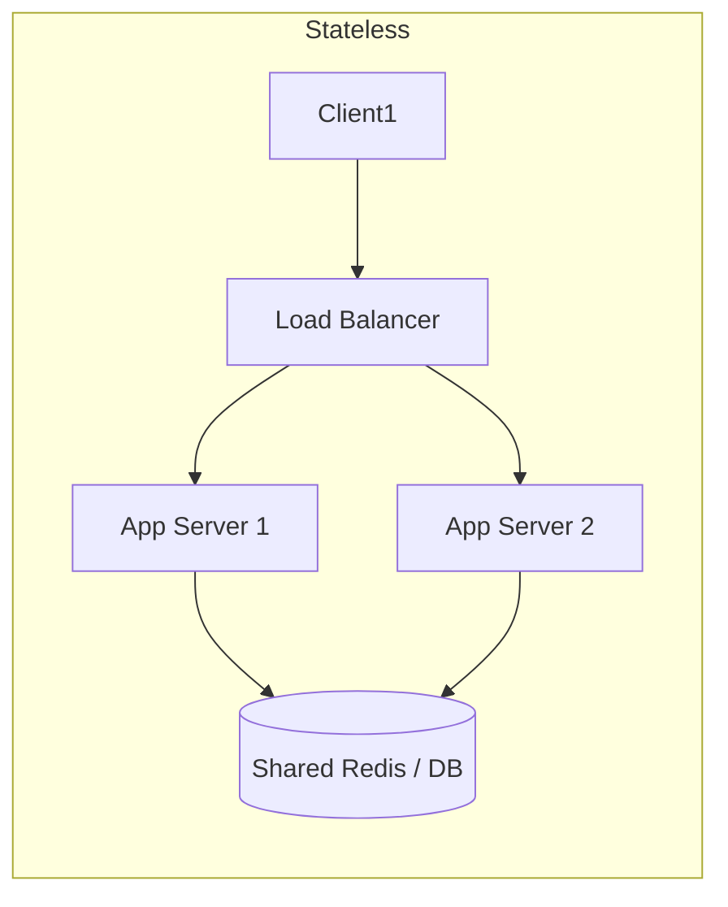

# 📈 Scalability, Availability & Reliability

Scalability and availability form the backbone of any distributed system design.

---

## 1. Vertical vs. Horizontal Scaling

| Dimension | Vertical Scaling (Scale Up) | Horizontal Scaling (Scale Out) |
|---|---|---|
| **Mechanism** | Add more CPU, RAM, or NVMe to an existing machine. | Add more commodity servers to a distributed cluster. |
| **Downtime** | Often requires hardware restart / downtime. | Zero downtime (rolling deployments, autoscaling). |
| **Hard Ceiling** | Limited by current physical hardware constraints. | Practically unlimited theoretical capacity. |
| **Complexity** | Simple: single system, no distributed network hops. | Complex: requires load balancers, distributed state, IPC. |
| **Cost** | Super-linear cost curve at high end (specialized hardware). | Linear cost curve (commodity cloud instances). |

---

## 2. Stateless vs. Stateful Architecture

* **Stateless Services**: Any incoming request can be served by any application instance. User session state is stored externally in Redis or a database. Nodes can scale up and down horizontally with zero friction.
* **Stateful Services**: Nodes retain local memory or storage critical to the ongoing connection (e.g., active WebSocket sessions, game state). Requires sticky sessions or consistent hashing at the load balancer.

---

## 3. Availability Math & Metrics

$$\text{Availability} = \frac{\text{Uptime}}{\text{Uptime} + \text{Downtime}} \times 100\%$$

| Availability ("Nines") | Downtime per Year | Downtime per Month | Downtime per Day |
|---|---|---|---|
| **99% (Two Nines)** | 3.65 days | 7.31 hours | 14.4 minutes |
| **99.9% (Three Nines)** | 8.77 hours | 43.8 minutes | 1.44 minutes |
| **99.99% (Four Nines)** | 52.6 minutes | 4.38 minutes | 8.64 seconds |
| **99.999% (Five Nines)** | 5.26 minutes | 26.3 seconds | 0.86 seconds |

### Key Reliability Metrics:
* **SLI (Service Level Indicator)**: What is measured (e.g., HTTP 200 response rate).
* **SLO (Service Level Objective)**: Target goal (e.g., 99.9% of requests succeed in $< 100\text{ms}$).
* **SLA (Service Level Agreement)**: Contractual commitment with penalties.
* **MTBF (Mean Time Between Failures)**: Average operating time between service crashes.
* **MTTR (Mean Time to Repair)**: Average time required to restore service after an outage.

---

## 4. High Availability Patterns

1. **Active-Passive (Cold / Warm / Hot Standby)**:
   - Primary handles 100% of traffic.
   - Heartbeat monitors primary. On failure, secondary promotes to primary via DNS update or Virtual IP swap.
2. **Active-Active**:
   - Both nodes actively serve traffic through a load balancer.
   - If one node fails, traffic is seamlessly shifted to surviving instances.
