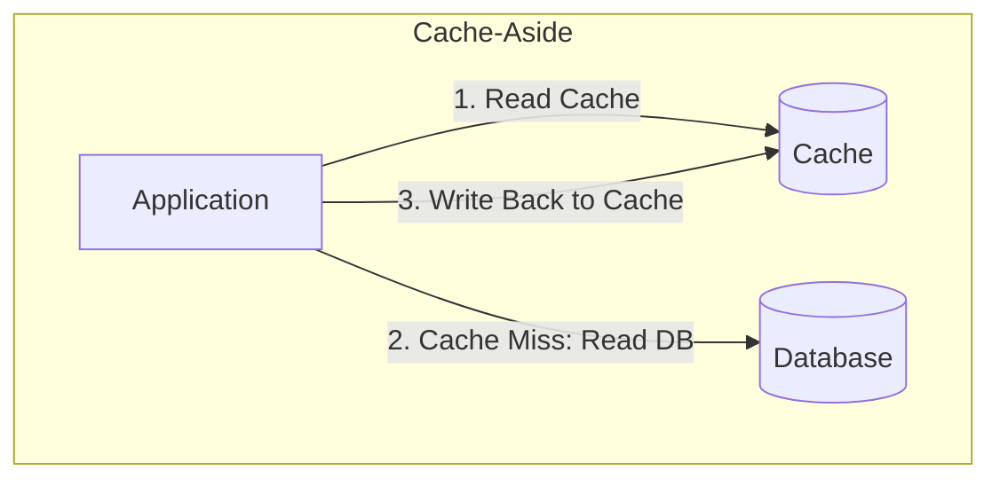

# ⚡ Caching Patterns, Strategies & Production Pitfalls

Caching reduces latency and absorbs read spikes by keeping frequently accessed data in high-speed volatile memory (RAM).

---

## 1. Caching Strategies (Write / Read Patterns)

### 1. Cache-Aside (Lazy Loading)
* Application first checks the cache.
* If **Hit**: Return cached data immediately.
* If **Miss**: Fetch from database, store result in cache, then return.
* **Pros**: Cache only contains requested data; node failure is non-fatal (falls back to DB).
* **Cons**: First request experiences cache-miss latency; risk of stale data if DB is updated directly.

### 2. Write-Through
* Application writes directly to the Cache, and the Cache immediately writes synchronously to the Database before acknowledging.
* **Pros**: Cache is never stale; high data consistency.
* **Cons**: Write latency is higher (two network round trips).

### 3. Write-Back (Write-Behind)
* Application writes to the Cache and receives immediate acknowledgment. The Cache asynchronously batches and flushes dirty writes to the Database.
* **Pros**: Ultra-fast write performance, absorbs write spikes.
* **Cons**: Data loss risk if the cache node crashes before flushing to the database.

### 4. Write-Around
* Writes bypass the cache entirely and write straight to the database.
* Data only enters the cache when subsequently read via Cache-Aside.
* **Pros**: Prevents cache pollution from write-once, never-read data.

---

## 2. Classic Production Cache Failure Modes & Mitigations

### 🌪️ 1. Cache Stampede / Thundering Herd
* **The Problem**: A high-traffic hot key (e.g., world cup score) expires. Simultaneously, 10,000 requests see a cache miss and hit the database at the exact same millisecond, crashing the DB.
* **Mitigations**:
  1. **Distributed Mutex Lock**: Only the first worker acquires a lock to query the DB and refresh cache; others wait or retry.
  2. **Probabilistic Early Expiration (XFetch algorithm)**: Recompute and refresh the key *before* it officially expires based on read frequency and computation cost.

### 🕳️ 2. Cache Penetration
* **The Problem**: Attackers query non-existent keys (e.g., `id = -99999`). Neither cache nor DB has it, causing every query to bypass the cache and hit the DB directly.
* **Mitigations**:
  1. **Bloom Filter**: In-memory probabilistic data structure that guarantees whether a key definitely does *not* exist in $O(1)$ time with zero false negatives.
  2. **Cache Null Values**: Store empty/null values with a short TTL (e.g., 60 seconds).

### 🏔️ 3. Cache Avalanche
* **The Problem**: A large batch of keys are stored with identical TTLs (e.g., 1 hour). When that hour passes, all keys expire simultaneously, overwhelming the database.
* **Mitigation**:
  * **Jitter**: Add random variance to the TTL:
    $$\text{TTL} = \text{base\_ttl} + \text{random\_uniform}(0, \text{jitter\_window})$$
