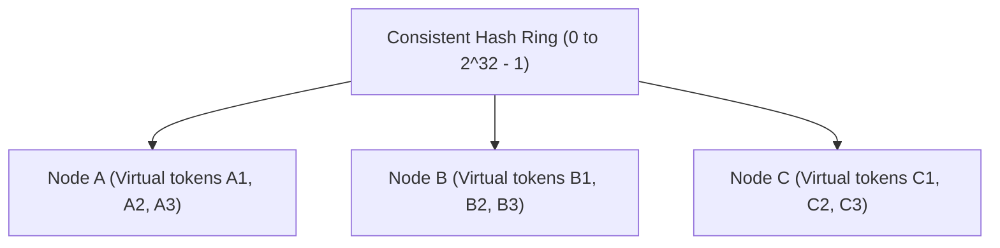

# 🌐 Networking Protocols, Proxies & Consistent Hashing

Modern distributed systems communicate across heterogeneous network protocols and balance load across elastic fleets.

---

## 1. Communication Protocols Compared

| Protocol | Underlying Transport | Multiplexing | Latency / Overhead | Best Use Case |
|---|---|---|---|---|
| **HTTP/1.1** | TCP | ❌ Head-of-line blocking | High (Repeats headers per request) | Legacy web systems |
| **HTTP/2** | TCP | ✅ Single TCP connection with bidirectional streams | Low (Header compression HPACK, binary framing) | Modern web browsers, Internal REST APIs |
| **HTTP/3** | QUIC (UDP) | ✅ Stream-level independence (no TCP HOL blocking) | Ultra-low (0-RTT connection resumption) | Mobile clients with fluctuating networks |
| **WebSockets** | TCP (Upgraded from HTTP) | Full-duplex persistent stream | Ultra-low after handshake | Chat, real-time multiplayer games, live tickers |
| **Server-Sent Events (SSE)** | HTTP/2 or 1.1 | Unidirectional (Server $\rightarrow$ Client) | Low | LLM text streaming, notification feeds |
| **gRPC** | HTTP/2 + Protocol Buffers | Full multiplexing & streaming | Minimal CPU & Bandwidth overhead | Inter-service microservice RPCs |

---

## 2. Load Balancing: Layer 4 vs. Layer 7

```
+-----------------------------------------------------------------------------------+
| Layer 4 (Transport Level)                  | Layer 7 (Application Level)          |
| Example: AWS NLB, Linux IPVS, HAProxy (TCP)| Example: AWS ALB, NGINX, Envoy, Traefik|
+--------------------------------------------+--------------------------------------+
| • Routes packets based on IP & Port.       | • Parses full HTTP headers, cookies, |
| • Operates without decrypting TLS.         |   URL paths, and JSON payloads.      |
| • Extremely fast throughput, minimal CPU.  | • Smart routing (e.g. /api vs /static)|
| • Cannot do content-based or path routing. | • TLS termination, auth & rate limit. |
+-----------------------------------------------------------------------------------+
```

---

## 3. Consistent Hashing

Consistent hashing maps both servers and keys to positions on a virtual circle (ring of size $2^{32} - 1$).



### Why Standard Modulo Hashing Fails:
In simple modulo hashing ($\text{Server} = \text{hash}(\text{key}) \pmod N$), adding or removing a single node forces almost $100\%$ of keys to relocate, causing massive cache misses.

### Consistent Hashing Advantages:
1. **Minimal Disruption**: When a node is added or removed, only $K/N$ keys need relocation on average (where $K$ = total keys, $N$ = total nodes).
2. **Virtual Nodes (Replicas)**: Each physical node is hashed $V$ times across the ring (e.g. `NodeA#1`, `NodeA#2`, etc.). This prevents hot-spots and ensures a smooth, uniform distribution of keys across all servers.
