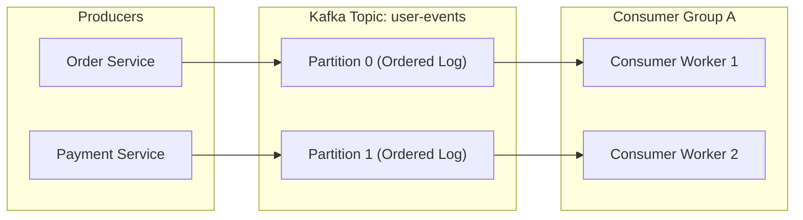
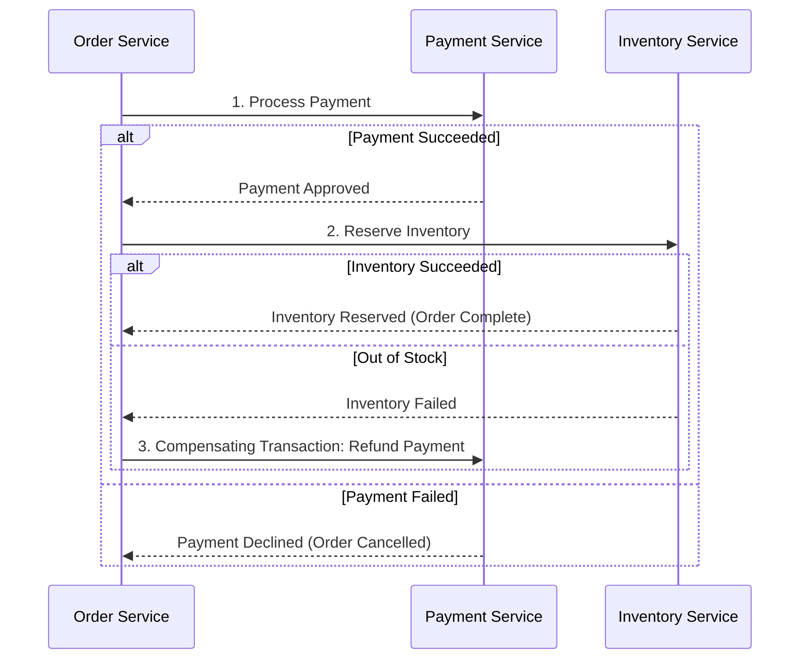

# 📨 Message Queues, Kafka & Event-Driven Architectures

Asynchronous messaging decouples producer and consumer services, absorbs spikes, and enables resilient event-driven architectures.

---

## 1. Message Queue (RabbitMQ) vs. Event Streaming (Kafka)

| Feature | Message Queue (RabbitMQ / SQS) | Event Streaming Log (Apache Kafka / Pulsar) |
|---|---|---|
| **Data Model** | Ephemeral: Messages are deleted once consumed and acknowledged. | Persistent: Append-only distributed commit log retained for $X$ days. |
| **Ordering** | Per-queue FIFO (can break with concurrent workers). | Strictly ordered per partition. |
| **Replayability** | ❌ No: Once consumed, messages are gone. | ✅ Yes: Consumers can rewind offsets to replay events from any point. |
| **Scale / Throughput** | Tens of thousands of messages/sec. | Millions of messages/sec via sequential disk I/O and zero-copy transfer. |
| **Best For** | Task delegation, complex routing (direct, topic, fanout). | High-throughput event sourcing, analytics, activity feeds. |

---

## 2. Apache Kafka Architecture & Internals

* **Partitions**: Unit of parallelism. Within a single partition, message order is guaranteed.
* **Partition Key**: Kafka hashes the key to assign messages to a specific partition:
  $$\text{Partition} = \text{MurmurHash2}(\text{Key}) \pmod{\text{NumPartitions}}$$
* **Consumer Groups**: Multiple consumers share reading duties. Each partition is consumed by only one consumer per consumer group.

---

## 3. Distributed Transactions: Two-Phase Commit (2PC) vs. Saga Pattern

### Why 2PC is Avoided in Modern Microservices:
* **Blocking**: All participating databases hold locks until the transaction coordinator commits or aborts.
* **Single Point of Failure**: If the coordinator crashes mid-transaction, participating nodes stay locked indefinitely.

### The Saga Pattern (Event-Driven Compensation)
Instead of global ACID locks, a Saga breaks a distributed transaction into a sequence of local transactions:

### Saga Approaches:
1. **Choreography**: Each service publishes domain events that trigger the next local transaction.
   - *Best for*: Simple workflows with 2-3 services.
2. **Orchestration**: A centralized orchestrator (e.g. Temporal, AWS Step Functions) coordinates state and explicitly dispatches execution and rollback commands.
   - *Best for*: Complex workflows with many steps and branching conditions.
