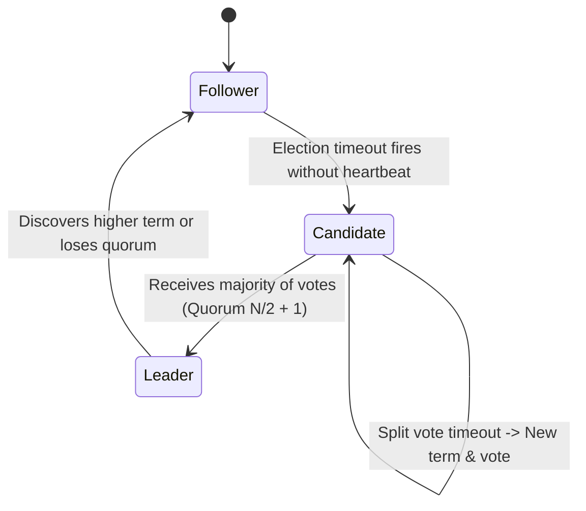

# 🤝 Distributed Consensus, Raft & Distributed Locks

In distributed systems where individual nodes fail, network links drop, and clocks drift, consensus algorithms guarantee that all healthy nodes agree on a single source of truth.

---

## 1. Why Consensus is Hard: The FLP Impossibility Result

The **Fischer-Lynch-Paterson (FLP)** theorem proved that in an asynchronous network, no deterministic consensus protocol can guarantee safety, liveness, and fault tolerance simultaneously if even a single node can fail silently.

Practical consensus algorithms (Paxos, Raft) make realistic partial-synchrony assumptions (e.g., bounds on message delays and randomized timeouts) to guarantee **Safety** under all conditions and **Liveness** whenever the network recovers.

---

## 2. Raft Consensus Algorithm

Raft decomposes consensus into three understandable, independent subproblems:



### The 3 Node Roles
1. **Leader**: Accepts client write commands, appends entries to its log, and replicates them to followers.
2. **Follower**: Passive listener. Responds to RPCs from the leader or candidates.
3. **Candidate**: State assumed when seeking election after an election timeout.

### 1. Leader Election & Heartbeats
* Nodes initialize as **Followers**. If a follower receives no heartbeat within a **randomized election timeout** ($150 - 300\text{ms}$), it increments its `current_term` and becomes a **Candidate**.
* The candidate votes for itself and broadcasts `RequestVote` RPCs.
* If it receives votes from a **strict majority** ($\lfloor N/2 \rfloor + 1$ nodes), it wins the election and sends periodic `AppendEntries` heartbeats.
* *Why randomized timeouts?* Prevents split-vote ties when multiple nodes time out simultaneously.

### 2. Log Replication & Commit Index
1. Client sends write command to Leader.
2. Leader appends command as an entry in its local log.
3. Leader sends `AppendEntries` RPC to all followers.
4. When a majority of followers acknowledge writing the entry to disk, the leader marks the entry as **Committed** and applies it to its state machine.
5. Leader responds to the client and informs followers of the commit in subsequent heartbeats.

---

## 3. Distributed Locking & Fencing Tokens

When coordinating access to shared resources across servers (e.g., only one batch worker runs at 2:00 AM), simple in-memory locks don't work.

```mermaid
sequenceDiagram
    participant Client1 as Client 1 (Paused by GC)
    participant LockService as Distributed Lock (ZooKeeper/Redis)
    participant Storage as Shared Storage Service
    participant Client2 as Client 2

    Client1->>LockService: Acquire Lock
    LockService-->>Client1: Granted (Fencing Token = 33)
    Note over Client1: Long GC Pause (5 seconds)... Lock Expires!
    Client2->>LockService: Acquire Lock
    LockService-->>Client2: Granted (Fencing Token = 34)
    Client2->>Storage: Write Data (Token = 34)
    Storage-->>Client2: Accepted (34 > last seen)
    Note over Client1: Wakes up from GC!
    Client1->>Storage: Write Data (Token = 33)
    Storage-->>Client1: REJECTED! (Token 33 is stale; current is 34)
```

### Martin Kleppmann's Fencing Token Rule
A distributed lock without fencing cannot prevent race conditions caused by process pauses (GC pauses, VM migrations, page faults).

* The lock service must generate a **monotonically increasing fencing token** with every lease grant.
* The target storage service checks:
  $$\text{if } \text{incoming\_token} > \text{last\_seen\_token} \implies \text{Accept and update last\_seen}$$
  $$\text{else} \implies \text{Reject write}$$

---

## 4. Technology Selection: ZooKeeper / Etcd vs. Redis Redlock

| Feature | ZooKeeper / Etcd / Consul | Redis (Single Node or Redlock) |
|---|---|---|
| **Consensus Protocol** | Zab (ZooKeeper), Raft (Etcd, Consul) | None (Asynchronous master-replica replication) |
| **Consistency Guarantees** | Strong Consistency (Linearizable) | Eventual Consistency (Risk of split-brain data loss) |
| **Session Tracking** | Ephemeral nodes with heartbeats | Key expiration TTL |
| **Best For** | Mission-critical metadata, cluster orchestration, leader election | Fast caching, non-financial task scheduling, soft deduplication |
