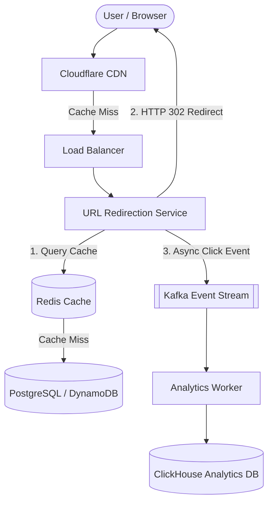

# 🔗 High-Level Design: Scalable URL Shortener (TinyURL)

A quintessential system design interview problem testing capacity estimation, encoding algorithms, caching, and data modeling.

---

## 1. Requirements & Scope

### Functional Requirements
1. **Shorten URL**: Given a long URL, generate a unique, short alias (e.g. `https://tiny.url/aBc12X`).
2. **Redirection**: Visiting the short URL redirects the user to the original long URL with minimal latency.
3. **Custom Aliases & Expiration**: Optional custom alias and TTL (expiration date).
4. **Analytics**: Track click count, referrers, and geographic location.

### Non-Functional Requirements
* **High Availability**: 99.99% uptime.
* **Low Latency**: Redirection response $< 20\text{ms}$.
* **Scale**: Read-heavy system (approx 100:1 read-to-write ratio).

---

## 2. Back-of-the-Envelope Capacity Estimation

* **Writes**: $100\text{ million new URLs/month} \approx 40\text{ writes/sec}$.
* **Reads (100:1)**: $4,000\text{ reads/sec}$ (Peak $\approx 8,000\text{ QPS}$).
* **Storage (5 Years)**:
  $$100\text{M} \times 12 \times 5 = 6\text{ Billion URLs}$$
  Assuming 500 bytes per record:
  $$6 \times 10^9 \times 500\text{ bytes} \approx 3\text{ TB total storage over 5 years}$$
* **Memory Caching (80/20 Rule)**:
  - Daily reads: $4,000 \times 86,400 \approx 345\text{M reads/day}$.
  - Daily data read: $345\text{M} \times 500\text{ bytes} \approx 172\text{ GB/day}$.
  - 20% cached in Redis: $0.20 \times 172\text{ GB} \approx 35\text{ GB RAM}$ (easily fits on a single Redis node or small cluster).

---

## 3. Short Code Generation Strategy

A short code of length 7 using **Base62** (`[a-z, A-Z, 0-9]`):
$$62^7 \approx 3.52\text{ Trillion unique URLs}$$
This comfortably satisfies our 6 billion requirement.

### Approach 1: Hash Truncation (MD5 / SHA256)
* Hash `long_url` with MD5 $\rightarrow$ take first 7 characters in Base62.
* *Problem*: Hash collisions require database lookups and appending random salts.

### Approach 2: Key Generation Service (KGS) - Best Practice
* A dedicated standalone service pre-generates billions of unique 7-character Base62 keys in advance and stores them in two tables: `unused_keys` and `used_keys`.
* Fast $O(1)$ key allocation with zero collision risk and zero hashing overhead.

---

## 4. End-to-End Architecture



---

## 5. Database Schema & Redirect Status Codes

### Relational Schema (PostgreSQL)
```sql
CREATE TABLE urls (
    id BIGSERIAL PRIMARY KEY,
    short_code VARCHAR(7) UNIQUE NOT NULL,
    original_url TEXT NOT NULL,
    user_id UUID,
    created_at TIMESTAMP WITH TIME ZONE DEFAULT NOW(),
    expires_at TIMESTAMP WITH TIME ZONE
);

CREATE INDEX idx_urls_short_code ON urls (short_code);
```

### HTTP 301 vs. HTTP 302 Redirects:
* **HTTP 301 (Moved Permanently)**: Browsers cache the redirect locally. Subsequent clicks bypass your server entirely $\rightarrow$ reduces server load, but **breaks analytics tracking**.
* **HTTP 302 (Found / Temporary Redirect)**: Browsers always send the request back to your server $\rightarrow$ slightly higher server load, but **guarantees 100% accurate click analytics**.
