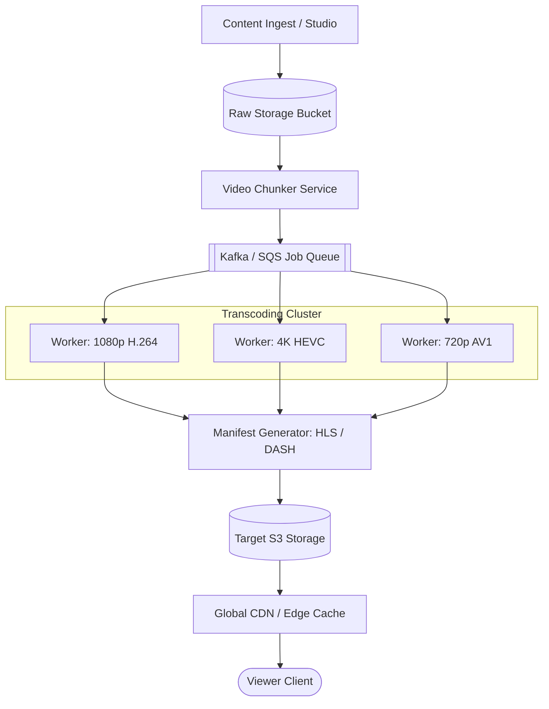

# 🎬 High-Level Design: Video Streaming Platform (Netflix / YouTube)

Architecture of a global video-on-demand platform supporting multi-device video transcoding, adaptive bitrate streaming, and global CDN delivery.

---

## 1. System Scale & Video Challenges

* **Raw Video Size**: A 2-hour 4K master file is roughly 100 GB.
* **Device Fragmentation**: Thousands of distinct screen sizes, network speeds (2G to Fiber), and hardware codec decoders (H.264, HEVC, AV1, VP9).
* **Latency**: Video playback must start in $< 500\text{ms}$ with zero buffering during playback.

---

## 2. Ingestion & Transcoding Pipeline (DAG Workflow)

---

## 3. Adaptive Bitrate Streaming (ABR: HLS & DASH)

Videos are not delivered as a single monolithic file. Instead:
1. Videos are chopped into **short 5 to 10-second segments** (`.ts` or `.m4s`).
2. An **index / master manifest file** (`.m3u8` or `.mpd`) lists all available resolutions, bitrates, and chunk URLs.
3. The client video player dynamically monitors current bandwidth and automatically requests higher or lower bitrate chunks on the fly.

---

## 4. Content Delivery Network (CDN) & Edge Caching

* Over 95% of video streaming bandwidth is absorbed directly by edge caching appliances (e.g., Netflix Open Connect, Cloudflare).
* **Tiered CDN Architecture**:
  - **Edge PoP**: Located directly inside ISP datacenters near end users, serving popular trending content.
  - **Origin Shield**: Middle-tier cache between Edge and cloud S3 buckets to prevent origin overload.
  - **Range Request (`HTTP 206 Partial Content`)**: Clients stream only the specific chunk bytes requested, saving bandwidth if the viewer exits early.
