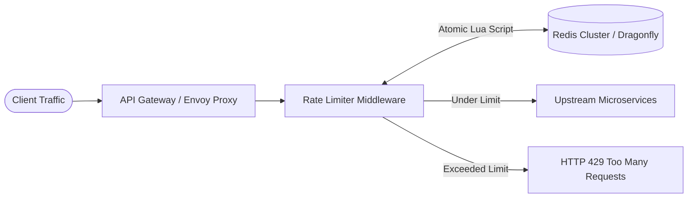

# 🛡️ High-Level Design: Distributed Rate Limiter

A mission-critical edge defense service designed to enforce rate limits across a globally distributed microservices fleet.

---

## 1. System Architecture



---

## 2. Distributed Sliding Window via Redis Lua Script

Running multiple round-trips (`GET` $\rightarrow$ verify $\rightarrow$ `INCR`) causes race conditions in distributed environments. A Lua script executes **atomically** on the Redis shard:

```lua
-- KEYS[1]: Rate limit key (e.g. "rate_limit:user_123")
-- ARGV[1]: Current UNIX timestamp (in seconds)
-- ARGV[2]: Window size (in seconds, e.g., 60)
-- ARGV[3]: Maximum allowed requests in window (e.g., 100)

local key = KEYS[1]
local now = tonumber(ARGV[1])
local window = tonumber(ARGV[2])
local limit = tonumber(ARGV[3])
local clear_before = now - window

-- 1. Remove timestamps older than the sliding window
redis.call('ZREMRANGEBYSCORE', key, 0, clear_before)

-- 2. Count requests in the current active window
local current_requests = redis.call('ZCARD', key)

-- 3. Check if current count exceeds the threshold
if current_requests < limit then
    -- Record this request with timestamp as score and member
    redis.call('ZADD', key, now, now .. '-' .. math.random())
    redis.call('EXPIRE', key, window)
    return 1 -- Allowed
else
    return 0 -- Throttled (429)
end
```

---

## 3. Standard HTTP Rate Limiting Headers

When returning responses, the gateway includes standard informational headers:

```http
HTTP/1.1 429 Too Many Requests
Content-Type: application/json
Retry-After: 42
X-RateLimit-Limit: 100
X-RateLimit-Remaining: 0
X-RateLimit-Reset: 1715004042

{
    "error": "Rate limit exceeded",
    "message": "Too many requests. Please retry after 42 seconds."
}
```

---

## 4. Failure Modes & Resilience (What if Redis Dies?)

* **Fail-Open vs. Fail-Closed**:
  - **Fail-Open (Recommended for non-critical APIs)**: If Redis is unreachable, let requests pass through so valid users aren't locked out.
  - **Fail-Closed (For high-risk/expensive endpoints)**: Throttle conservatively to protect downstream payment gateways or generative AI pipelines from unbounded cost spikes.
* **Local In-Memory Cache (Token Bucket fallback)**: Keep a local per-node token bucket inside the API gateway to absorb burst traffic during cache outages.
