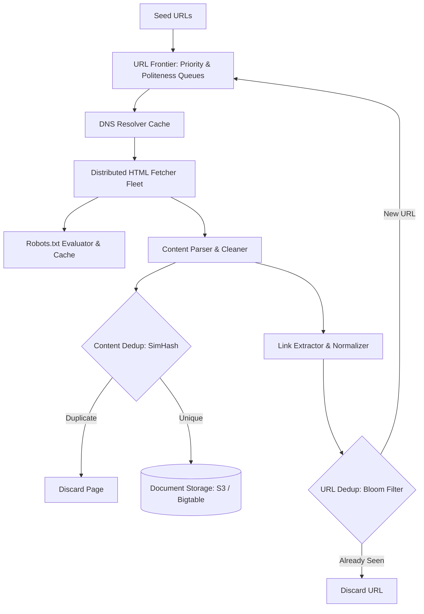

# 🕷️ High-Level Design: Distributed Web Crawler (Google / Bing)

A large-scale web crawler traverses the internet, downloads billions of web pages, parses content, and indexes links for search engines.

---

## 1. Requirements & Scale

### Functional Requirements
1. **HTML Fetching**: Download web pages given seed URLs.
2. **Link Extraction**: Extract hyperlinks and recursively enqueue new URLs.
3. **Deduplication**: Avoid re-downloading identical URLs or near-duplicate web content.
4. **Politeness**: Respect `robots.txt` and throttle requests so target web hosts are not overwhelmed.

### Non-Functional Requirements & Capacity Math
* **Scale**: Crawl 1 billion pages per month.
  $$\text{QPS} = \frac{10^9}{30 \times 86,400} \approx 400\text{ pages/sec (Peak: } 1,000\text{ pages/sec)}$$
* **Storage**: Average page size = 100 KB.
  $$\text{Storage/Month} = 10^9 \times 100\text{ KB} = 100\text{ TB/month} \rightarrow 6\text{ PB over 5 years}$$

---

## 2. End-to-End Crawler Architecture



---

## 3. The URL Frontier: Politeness & Prioritization

A naive FIFO queue overwhelms single hosts and gets crawler IP addresses banned. The URL Frontier solves this via **Priority** and **Politeness** queues:

```
[Inbound URLs] 
      │
      ▼
┌────────────────────────────────┐
│ Priority Queues (F1, F2, F3)   │ (Categorized by PageRank & update frequency)
└────────────────────────────────┘
      │
      ▼
┌────────────────────────────────┐
│ Politeness Router (by Hostname)│
└────────────────────────────────┘
      │
      ├──> Host A Queue (cnn.com)      ───[ Delay: 1 req/sec ]───> Fetcher
      ├──> Host B Queue (wikipedia.org)───[ Delay: 2 req/sec ]───> Fetcher
      └──> Host C Queue (github.com)   ───[ Delay: 0.5 req/sec ]─> Fetcher
```

* **Prioritizer**: Sorts URLs by PageRank and freshness so high-value domains are crawled first.
* **Politeness Queues**: One queue per hostname. A mapping table records `last_crawled_time(host)`. A queue is only polled when `now - last_crawled_time > crawl_delay`.

---

## 4. Deduplication Strategies

1. **URL Deduplication (Bloom Filter)**:
   - Maintains an in-memory Bloom filter of 1 billion hashed URLs.
   - Requires $< 1.2\text{ GB}$ of RAM with a $< 1\%$ false positive rate.
2. **Content Deduplication (SimHash / MinHash)**:
   - Spider traps and mirror sites serve identical or near-identical text on different URLs.
   - Computes a 64-bit **SimHash fingerprint** of the page text. If Hamming distance $< 3$, the page is flagged as a near-duplicate and skipped.

---

## 5. DNS Resolution Bottleneck

DNS lookups can take up to $100 - 500\text{ms}$. If synchronous, fetchers spend 80% of their time waiting on DNS.
* **Solution**: Maintain a distributed, in-memory DNS cache (Redis or local memory updated via asynchronous DNS worker threads).
