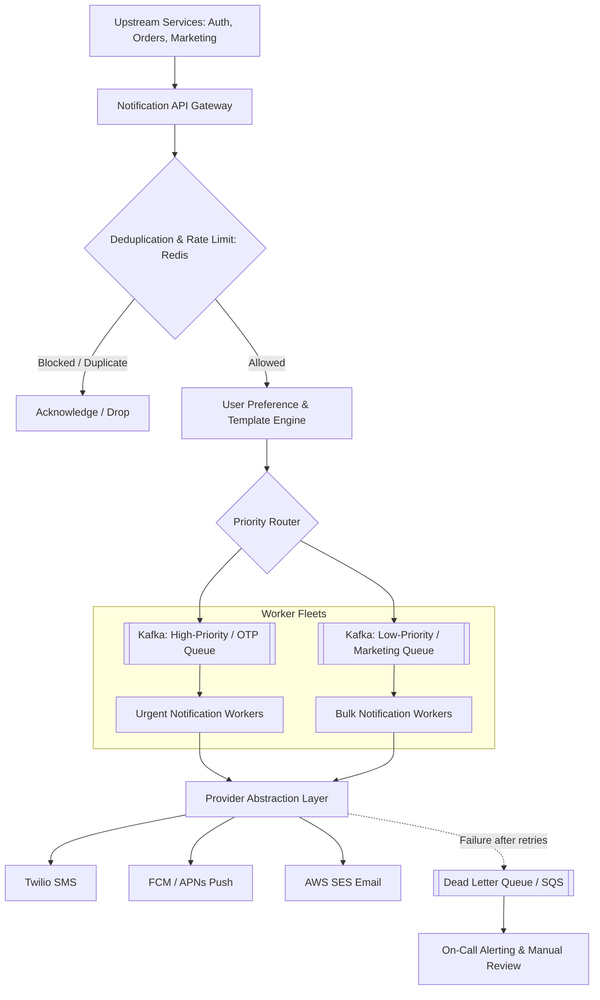

# 🔔 High-Level Design: Distributed Multi-Channel Notification System

A highly available notification platform that fans out millions of notifications across SMS, Email, Mobile Push, and In-App channels.

---

## 1. System Requirements

### Functional Requirements
1. **Multi-Channel Delivery**: Support Email (SendGrid/SES), SMS (Twilio), Mobile Push (APNs/FCM), and In-App WebSockets.
2. **Priority Tiers**: Urgent transactional messages (OTP, security alerts) must not be delayed by bulk marketing campaigns.
3. **User Preferences**: Honor user notification preferences (e.g., unsubscribed from marketing emails, SMS only for 2FA).
4. **Rate Limiting & De-duplication**: Cap maximum notifications per user per hour to prevent spamming; deduplicate repeated API requests.

### Non-Functional Requirements
* **Throughput**: 50,000 notifications per second.
* **Latency**: Critical OTPs delivered in $< 3\text{ seconds}$.
* **Resilience**: Zero lost messages; retry failed deliveries using Dead Letter Queues (DLQ).

---

## 2. End-to-End System Architecture



---

## 3. High vs. Low Priority Queue Partitioning

If millions of promotional emails enter the same queue as two-factor authentication (2FA) codes, OTPs experience 20-minute delays, breaking user logins.

* **High-Priority Queue**: Dedicated Kafka topic for OTPs, password resets, fraud alerts. Scaled with aggressive worker ratios ($10:1$ worker-to-partition allocation).
* **Low-Priority Queue**: Separate topic for weekly digests, promotions, social media likes with backpressure throttling.

---

## 4. Deduplication & Idempotency Key Pattern

To prevent charging a customer twice or sending 5 identical text messages due to network timeouts:

```python
def should_send_notification(redis_client, idempotency_key: str, user_id: str, channel: str) -> bool:
    """
    Guarantees at-most-once delivery per idempotency key within 24 hours.
    """
    key = f"notif_idemp:{idempotency_key}"
    # Atomically sets key if not exists with 24-hour TTL
    is_new = redis_client.set(key, "PROCESSING", nx=True, ex=86400)
    if not is_new:
        return False  # Already processed or currently in-flight

    # User-level frequency capping (e.g., max 5 SMS per hour)
    user_hourly_key = f"user_rate:{user_id}:{channel}"
    count = redis_client.incr(user_hourly_key)
    if count == 1:
        redis_client.expire(user_hourly_key, 3600)
    
    if count > 5:
        print(f"User {user_id} exceeded hourly limit for {channel}")
        return False

    return True
```

---

## 5. Third-Party Provider Failover

Third-party gateways (e.g., Twilio or SendGrid) experience regional outages. The Provider Abstraction layer uses a **Circuit Breaker** pattern:
* If Twilio fails 5% of requests over 1 minute $\rightarrow$ automatically route outgoing SMS to alternate vendor (e.g., Sinch or AWS SNS).
