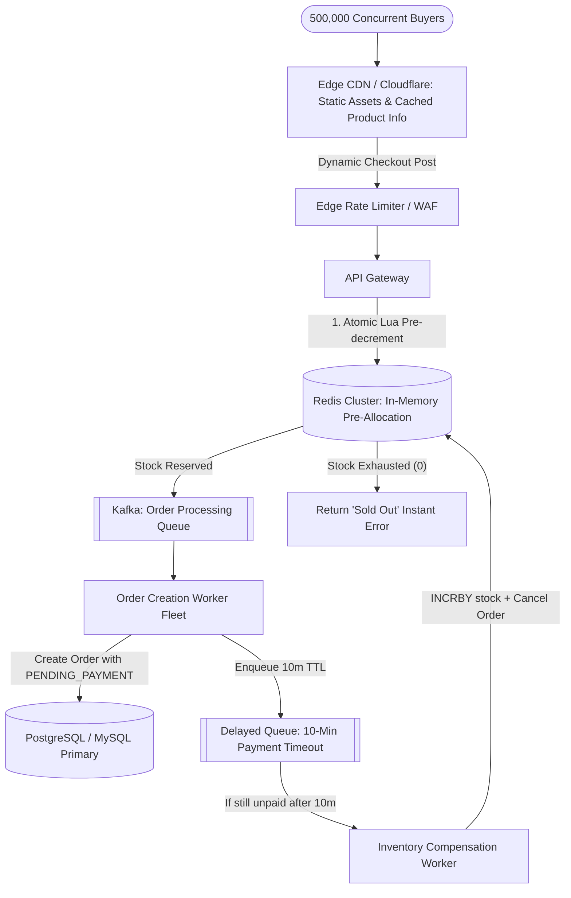

# ⚡ High-Level Design: Flash Sale & High-Concurrency Inventory System

Designing an e-commerce flash sale system (Amazon Prime Day, Ticketmaster, Sneaker Drops) where millions of users compete for 5,000 limited inventory units in under 60 seconds.

---

## 1. The Core Challenges

1. **Massive Read Spikes**: $500,000\text{ QPS}$ refreshing product pages.
2. **Lock Contention**: Traditional relational databases lock rows (`SELECT ... FOR UPDATE`). 50,000 concurrent updates on a single row cause connection pool exhaustion and database death.
3. **Zero Overselling**: Under no circumstances may 5,001 items be sold for 5,000 items in stock.
4. **Order Holding & Expiration**: Users get 10 minutes to complete payment. If unpaid, reserved stock must return to the pool automatically.

---

## 2. Multi-Layer Traffic Deflection Architecture



---

## 3. Atomic Inventory Deduction via Redis Lua Script

To prevent database deadlocks and overselling, maintain stock counters in Redis and execute the reservation in a single atomic Lua script:

```lua
-- KEYS[1]: Item stock key, e.g., "item_stock:prod_9981"
-- KEYS[2]: User purchase record key, e.g., "user_bought:prod_9981:user_123"
-- ARGV[1]: Quantity to buy (typically 1)

local stock = tonumber(redis.call('get', KEYS[1]) or 0)
local has_bought = redis.call('exists', KEYS[2])

if has_bought == 1 then
    return -1 -- User already purchased / reserved once
end

if stock >= tonumber(ARGV[1]) then
    redis.call('decrby', KEYS[1], ARGV[1])
    redis.call('set', KEYS[2], 1, 'EX', 86400) -- Prevent double purchase
    return 1 -- Reservation success
else
    return 0 -- Sold out
end
```

---

## 4. Asynchronous Order Creation with Payment TTL

1. **Instant User Feedback**: If Lua returns `1`, the client receives `HTTP 202 Accepted` ("Your order has been reserved! Please pay within 10 minutes").
2. **Asynchronous Persistence**: A Kafka message buffers writes. Worker fleets insert orders at a controlled rate ($\approx 2,000\text{ writes/sec}$) without crashing the relational database.
3. **Payment Reconciliation & Expiration**:
   - When payment succeeds $\rightarrow$ Order status transitions from `PENDING_PAYMENT` to `PAID`.
   - If payment is not completed within 10 minutes $\rightarrow$ The delayed queue triggers a rollback:
     ```sql
     UPDATE orders SET status = 'EXPIRED' WHERE order_id = ? AND status = 'PENDING_PAYMENT';
     ```
   - Increment Redis stock: `redis.incrby("item_stock:prod_9981", 1)`.
