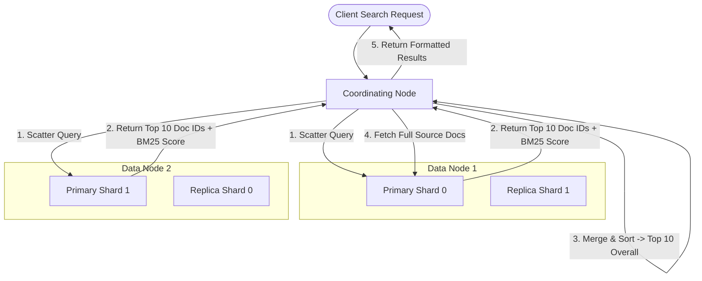

# 🔍 High-Level Design: Distributed Search Engine (Elasticsearch / Lucene)

Architecture of a distributed, real-time, full-text search engine capable of indexing billions of documents and returning fuzzy, ranked search results in milliseconds.

---

## 1. Core Data Structure: The Inverted Index

Unlike relational databases that map `Row ID -> Columns`, a search engine maps `Term -> Document IDs containing that term`.

```
Raw Documents:
Doc 1: "Distributed systems are resilient"
Doc 2: "Resilient systems scale horizontally"

Inverted Index:
Term         │ Postings List (Doc IDs + Positions)
─────────────┼─────────────────────────────────────
distributed  │ [Doc 1 (pos 0)]
horizontally │ [Doc 2 (pos 3)]
resilient    │ [Doc 1 (pos 3), Doc 2 (pos 0)]
scale        │ [Doc 2 (pos 2)]
systems      │ [Doc 1 (pos 1), Doc 2 (pos 1)]
```

### Components of the Inverted Index:
1. **Term Dictionary**: Sorted list of all unique vocabulary terms, stored in memory using a **Finite State Transducer (FST)** for fast prefix and fuzzy searches.
2. **Postings List**: Sorted list of document IDs where each term appears, compressed using **Roaring Bitmaps** or Frame of Reference (FOR) for instant bitwise intersection (`AND`) and union (`OR`).

---

## 2. Distributed Cluster Architecture



---

## 3. Two-Phase Query Execution (Scatter-Gather)

When a client queries `q="system design"` across a cluster with 10 shards:

### Phase 1: Query Phase
1. Coordinating node broadcasts the search query to a copy of each shard (either primary or replica).
2. Each shard searches locally and computes relevance scores using **BM25 (Best Matching 25)**.
3. Each shard returns only the top $K$ document IDs and their score (e.g. top 10) to the coordinator. Postings lists are not transferred.

### Phase 2: Fetch Phase
1. Coordinating node merges the score lists from all shards, sorts them globally, and selects the overall top 10 documents.
2. Coordinator sends point requests directly to the specific shards holding those 10 documents to retrieve the full document JSON source.
3. Coordinator assembles the final payload and returns it to the client.

---

## 4. Segment Immutability & Background Merging

* In Lucene/Elasticsearch, inverted index segments are **immutable** once written to disk.
* **Deletes**: Recorded in a separate `.del` bitset tombstone rather than mutating segments in place.
* **Background Merging**: A background thread continuously combines smaller segments into larger ones and purges deleted documents, keeping file handles and query times optimal.
