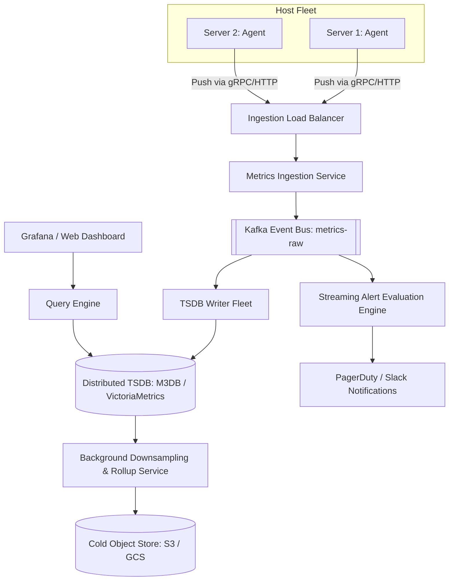

# 📊 High-Level Design: Distributed Metrics & Monitoring (Datadog / Prometheus)

Architecture of a high-throughput time-series metrics collection, storage, visualization, and alerting platform capable of processing billions of data points per second.

---

## 1. Data Model & Scale

A metric data point contains four core fields:
$$\text{Data Point} = \{\text{Metric Name}, \text{Labels/Tags}, \text{Timestamp}, \text{Value}\}$$

*Example*:
`http_requests_total{service="payment", method="POST", status="500"} 42 @ 1715000000`

### Scale Estimation:
* 50,000 servers $\times$ 1,000 metrics per server every 10 seconds:
  $$\text{Throughput} = \frac{50,000 \times 1,000}{10} = 5,000,000\text{ metric data points/sec}$$

---

## 2. Push vs. Pull Metrics Collection

| Dimension | Pull Model (Prometheus) | Push Model (Datadog / Graphite / OpenTelemetry) |
|---|---|---|
| **Mechanism** | Central server scrapes `/metrics` HTTP endpoints on instances. | Agents on instances push metrics to a centralized load balancer. |
| **Service Discovery** | Central server queries Kubernetes / Consul to find targets. | Minimal central discovery; instances know gateway address. |
| **Short-Lived Jobs** | ❌ Struggles with ephemeral AWS Lambda or batch cron jobs. | ✅ Excels at short-lived batch jobs (just push on exit). |
| **Security / Firewall** | Requires inbound firewall access to application ports. | Only requires outbound HTTPS egress from instances. |

---

## 3. End-to-End System Architecture

---

## 4. Time-Series Storage & Gorilla Compression

Raw 64-bit timestamps and 64-bit float values consume 16 bytes per point. At 5M points/sec, that requires $80\text{ MB/sec} \approx 7\text{ TB/day}$.

### Gorilla Compression (Facebook Paper)
Reduces memory footprint from 16 bytes down to **1.37 bytes per data point**:
1. **Timestamp Compression (Delta-of-Delta)**:
   - Most metrics arrive at fixed intervals (e.g. every 10 seconds).
   - $D = (t_i - t_{i-1}) - (t_{i-1} - t_{i-2})$. If interval is constant, $D = 0$ (encoded as a single `0` bit).
2. **Value Compression (XOR Floating Point)**:
   - Metrics rarely change drastically between consecutive readings.
   - $V = \text{val}_i \oplus \text{val}_{i-1}$. Consecutive identical values yield 0 (encoded in 1 bit).

---

## 5. Downsampling & Retention Policies

Retaining second-level resolution forever is cost-prohibitive. Systems use a multi-tiered retention policy:
* **Raw (10-second resolution)**: Retained for 7 days in RAM/SSD.
* **5-Minute Rollups (Min, Max, Avg, P99)**: Retained for 30 days.
* **1-Hour Rollups**: Retained for 1 year in cost-effective object storage (S3).
