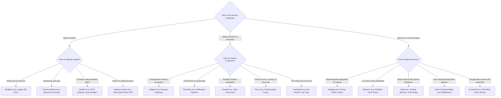

# 🎯 System Design & Object-Oriented Design Interview Framework

A structured, battle-tested playbook for cracking **Low-Level Design (LLD / Machine Coding)** and **High-Level Design (HLD / Distributed Systems)** interviews at top tech companies (Google, Meta, Amazon, Uber, Microsoft, Stripe).

---

## ⏱️ 45-Minute Interview Blueprint

```
+---------------------------------------------------------------------------------+
|                                 LLD (45 Mins)                                   |
+-------------------+--------------------+--------------------+-------------------+
| 00-05 min: Scope  | 05-15 min: Model   | 15-35 min: Code    | 35-45 min: Edge   |
| Requirements &    | Class Diagram &    | Clean Code &       | Cases, Concurrency|
| Constraints       | Design Patterns    | Extensibility      | & Refactoring     |
+-------------------+--------------------+--------------------+-------------------+

+---------------------------------------------------------------------------------+
|                                 HLD (45 Mins)                                   |
+-------------------+--------------------+--------------------+-------------------+
| 00-05 min: Scope  | 05-12 min: Math &  | 12-30 min: Core    | 30-45 min: Deep   |
| Requirements &    | Scale, API Design, | Diagram, Storage,  | Dive, Bottlenecks,|
| Trade-offs        | DB Schemas         | Data Flow          | Failures & HA     |
+-------------------+--------------------+--------------------+-------------------+
```

---

## 🧭 LLD Design Pattern Decision Tree

When solving an LLD problem, use this decision tree to pick the right pattern:



---

## 🗄️ HLD Technology Selection Matrix

| Workload / Use Case | Recommended Storage / Tech | Rationale & Trade-offs |
|---|---|---|
| **ACID Transactions, Financial Ledgers** | PostgreSQL, MySQL, CockroachDB | Strong consistency, foreign keys, row-level locking. |
| **High-Throughput Append Logs, Chat History** | ScyllaDB, Apache Cassandra | Wide-column, linear write scaling, partition key + timeuuid clustering. |
| **Sub-Millisecond In-Memory Caching, Rate Limiting** | Redis, Dragonfly, Memcached | In-memory key-value, atomic Lua scripts, TTL expiration. |
| **Hierarchical Nested Data, Catalogs** | MongoDB, Couchbase | Document store, flexible BSON schemas, fast single-doc reads. |
| **Complex Relationship Traversal (Friends of Friends)** | Neo4j, Amazon Neptune | Graph DB, index-free adjacency ($O(1)$ edge pointer traversal). |
| **High-Volume Time-Series Metrics & Logs** | VictoriaMetrics, M3DB, ClickHouse | Columnar/TSDB, Gorilla delta-of-delta compression, high write ingestion. |
| **Full-Text Ranked Search & Filtering** | Elasticsearch, OpenSearch | Inverted Index, BM25 scoring, term dictionary FST, roaring bitmaps. |
| **Distributed Asynchronous Event Streaming** | Apache Kafka, Apache Pulsar | Ordered partition logs, replayable offset consumer groups. |

---

## 📅 30-Day LLD & HLD Mastery Roadmap

```
Week 1: Foundations & OOP
├── Day 1-2: Master SOLID Principles (Write bad vs good refactored code).
├── Day 3-4: Creational & Structural Design Patterns (Factory, Builder, Adapter, Decorator).
├── Day 5-6: Behavioral Patterns (Strategy, Observer, State, Chain of Responsibility).
└── Day 7: Concurrency basics (Mutexes, RWLocks, Deadlock prevention, Producer-Consumer).

Week 2: Machine Coding Drill (LLD)
├── Day 8: Parking Lot System (Multi-floor, vehicle types, pricing strategies).
├── Day 9: Rate Limiter (Token Bucket & Sliding Window Counter).
├── Day 10: LRU Cache (Hash Map + Doubly Linked List from scratch).
├── Day 11: Splitwise (Equal/Exact/Percent splits & debt simplification graph algorithm).
├── Day 12: Vending Machine (State pattern implementation).
├── Day 13: In-Memory File System (Trie / Composite).
└── Day 14: Review, run test suites (`python3 tests/run_all.py`), timing drills.

Week 3: Distributed Systems Foundations (HLD)
├── Day 15: Scalability, Availability (Active-Active, SLAs, SLOs).
├── Day 16: Caching strategies (Cache-Aside, Write-Back, Stampede, Bloom Filters).
├── Day 17: Database internals (B+ Tree vs LSM Tree, Sharding, Replication, CAP & PACELC).
├── Day 18: Networking & Proxies (HTTP/2, HTTP/3, WebSockets, gRPC, Consistent Hashing).
├── Day 19: Message Queues & Distributed Transactions (Kafka, 2PC vs Saga).
├── Day 20: Security, Authentication (JWT vs Sessions, OAuth2, PKCE, mTLS).
└── Day 21: Consensus & Distributed Locks (Raft, ZooKeeper vs Redlock, Fencing Tokens).

Week 4: High-Level System Design Architectures
├── Day 22: URL Shortener (TinyURL) & Distributed Rate Limiter.
├── Day 23: Real-Time Chat System (WhatsApp / Slack).
├── Day 24: Video Streaming Platform (Netflix / YouTube).
├── Day 25: Ride-Sharing Service (Uber / Lyft with H3 Hexagonal Grid).
├── Day 26: Distributed Web Crawler (Google / Bing with URL Frontier & SimHash).
├── Day 27: Multi-Channel Notification System (Priority queues, DLQ).
├── Day 28: E-Commerce Flash Sale System (Redis Lua atomic stock decrement).
├── Day 29: Distributed Search Engine (Elasticsearch Inverted Index & Scatter-Gather).
└── Day 30: Full 45-minute mock interview simulations on whiteboard.
```

---

## 🧮 Latency Numbers Every System Designer Must Know

| Operation | Latency (approx) | Real-world Equivalent |
|---|---|---|
| L1 Cache reference | 0.5 - 1 ns | 1 Heartbeat |
| Branch mispredict | 3 - 5 ns | |
| L2 Cache reference | 7 ns | |
| Mutex Lock / Unlock | 25 ns | |
| Main Memory (RAM) reference | 100 ns | |
| Read 1 MB sequentially from memory | 3,000 ns (3 µs) | |
| SSD Random Read | 16,000 ns (16 µs) | |
| Read 1 MB sequentially from SSD | 50,000 ns (50 µs) | |
| Datacenter Round-Trip (RTT) | 500,000 ns (500 µs) | Half a millisecond |
| HDD Random Seek | 10,000,000 ns (10 ms) | 20x slower than SSD |
| Read 1 MB sequentially from HDD | 20,000,000 ns (20 ms) | |
| Cross-continent RTT (CA $\rightarrow$ NL) | 150,000,000 ns (150 ms) | Easily noticeable |

---

## 🚫 Common Interview Anti-Patterns

1. **Jumping straight to architecture without requirements**: Spending 20 minutes designing Kafka pipelines when the system only handles 5 requests per second.
2. **Ignoring the Read/Write Ratio**: A 100:1 read-heavy system requires heavy caching and replica scaling, while a 1:1 write-heavy system needs append-only logs and LSM-tree storage (Cassandra/Scylla).
3. **Keyword Bingo**: Mentioning Kubernetes, GraphQL, Kafka, and Redis without explaining *why* they solve the specific bottleneck.
4. **Neglecting Data Consistency**: Claiming a financial transaction system uses "eventual consistency" without explaining how double spending or balances are reconciled.
5. **No Single Point of Failure (SPOF) Analysis**: Failing to review if a single database node, load balancer, or cache server can bring down the entire system.
