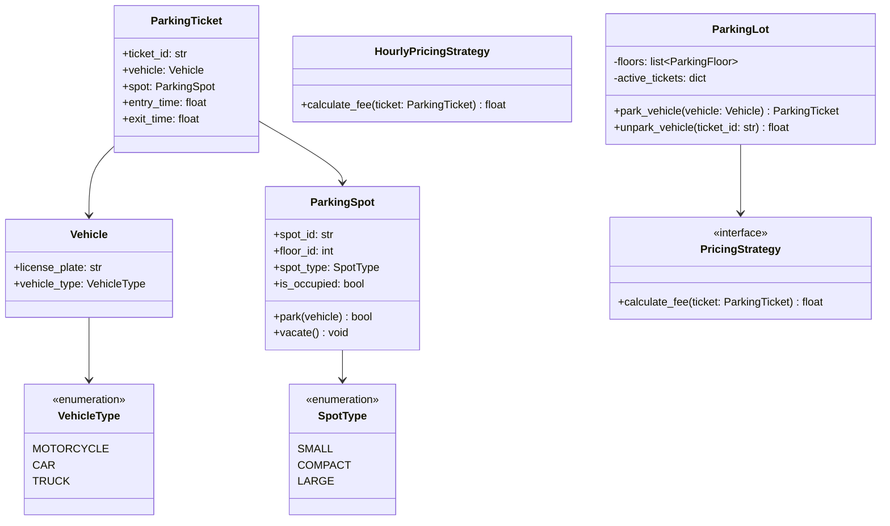

# 🚗 Low-Level Design: Multi-Floor Parking Lot System

A classic machine coding problem frequently asked at Amazon, Google, Uber, and Microsoft.

---

## 1. Problem Statement & Requirements

### Functional Requirements
1. **Multi-Floor Support**: A parking lot has multiple floors, and each floor has multiple parking spots.
2. **Vehicle Types**: Supports different vehicle types: `Motorcycle`, `Car`, `Truck/Bus`.
3. **Spot Compatibility**:
   - Small spots $\rightarrow$ Motorcycles only.
   - Compact spots $\rightarrow$ Cars and Motorcycles.
   - Large spots $\rightarrow$ Trucks, Cars, and Motorcycles.
4. **Ticket Issuance**: When a vehicle enters, allocate the nearest available compatible spot and issue a `ParkingTicket`.
5. **Fee Calculation**: Upon exit, calculate parking fees based on duration and vehicle type using pluggable pricing strategies.
6. **Concurrency**: Handle concurrent entries and exits across multiple gates safely.

---

## 2. Class Diagram



---

## 3. Python Implementation

```python
from abc import ABC, abstractmethod
from enum import Enum
import time
import uuid
import threading
from typing import Optional

class VehicleType(Enum):
    MOTORCYCLE = 1
    CAR = 2
    TRUCK = 3

class SpotType(Enum):
    SMALL = 1
    COMPACT = 2
    LARGE = 3

class Vehicle:
    def __init__(self, license_plate: str, vehicle_type: VehicleType):
        self.license_plate = license_plate
        self.vehicle_type = vehicle_type

class ParkingSpot:
    def __init__(self, spot_id: str, floor_id: int, spot_type: SpotType):
        self.spot_id = spot_id
        self.floor_id = floor_id
        self.spot_type = spot_type
        self.parked_vehicle: Optional[Vehicle] = None
        self._lock = threading.Lock()

    def can_fit(self, vehicle: Vehicle) -> bool:
        if self.spot_type == SpotType.SMALL:
            return vehicle.vehicle_type == VehicleType.MOTORCYCLE
        elif self.spot_type == SpotType.COMPACT:
            return vehicle.vehicle_type in [VehicleType.MOTORCYCLE, VehicleType.CAR]
        elif self.spot_type == SpotType.LARGE:
            return True
        return False

    def park(self, vehicle: Vehicle) -> bool:
        with self._lock:
            if self.parked_vehicle is None and self.can_fit(vehicle):
                self.parked_vehicle = vehicle
                return True
            return False

    def vacate(self) -> None:
        with self._lock:
            self.parked_vehicle = None

class ParkingTicket:
    def __init__(self, vehicle: Vehicle, spot: ParkingSpot):
        self.ticket_id = str(uuid.uuid4())[:8]
        self.vehicle = vehicle
        self.spot = spot
        self.entry_time = time.time()
        self.exit_time: Optional[float] = None

class PricingStrategy(ABC):
    @abstractmethod
    def calculate(self, ticket: ParkingTicket) -> float:
        pass

class HourlyPricingStrategy(PricingStrategy):
    RATES = {
        VehicleType.MOTORCYCLE: 10.0,
        VehicleType.CAR: 20.0,
        VehicleType.TRUCK: 40.0
    }

    def calculate(self, ticket: ParkingTicket) -> float:
        duration_hours = max(1.0, (ticket.exit_time - ticket.entry_time) / 3600.0)
        hourly_rate = self.RATES.get(ticket.vehicle.vehicle_type, 20.0)
        return round(duration_hours * hourly_rate, 2)

class ParkingFloor:
    def __init__(self, floor_id: int, spots: list[ParkingSpot]):
        self.floor_id = floor_id
        self.spots = spots

    def find_available_spot(self, vehicle: Vehicle) -> Optional[ParkingSpot]:
        for spot in self.spots:
            if spot.parked_vehicle is None and spot.can_fit(vehicle):
                return spot
        return None

class ParkingLot:
    _instance = None
    _lock = threading.Lock()

    def __new__(cls, *args, **kwargs):
        if not cls._instance:
            with cls._lock:
                if not cls._instance:
                    cls._instance = super(ParkingLot, cls).__new__(cls)
        return cls._instance

    def __init__(self, floors: list[ParkingFloor], pricing_strategy: PricingStrategy):
        self.floors = floors
        self.pricing_strategy = pricing_strategy
        self.active_tickets: dict[str, ParkingTicket] = {}
        self._parking_lock = threading.Lock()

    def enter(self, vehicle: Vehicle) -> Optional[ParkingTicket]:
        with self._parking_lock:
            for floor in self.floors:
                spot = floor.find_available_spot(vehicle)
                if spot and spot.park(vehicle):
                    ticket = ParkingTicket(vehicle, spot)
                    self.active_tickets[ticket.ticket_id] = ticket
                    print(f"✅ Vehicle {vehicle.license_plate} parked at Spot {spot.spot_id} on Floor {floor.floor_id}")
                    return ticket
            print(f"❌ No available spot found for vehicle {vehicle.license_plate}")
            return None

    def exit(self, ticket_id: str) -> Optional[float]:
        with self._parking_lock:
            ticket = self.active_tickets.get(ticket_id)
            if not ticket:
                print(f"❌ Invalid ticket ID: {ticket_id}")
                return None
            
            ticket.exit_time = time.time()
            ticket.spot.vacate()
            fee = self.pricing_strategy.calculate(ticket)
            del self.active_tickets[ticket_id]
            print(f"🚪 Vehicle {ticket.vehicle.license_plate} exited. Total Fee: ${fee}")
            return fee

# --- Simulation ---
if __name__ == "__main__":
    spots_floor_1 = [
        ParkingSpot("1-S1", 1, SpotType.SMALL),
        ParkingSpot("1-C1", 1, SpotType.COMPACT),
        ParkingSpot("1-L1", 1, SpotType.LARGE),
    ]
    lot = ParkingLot([ParkingFloor(1, spots_floor_1)], HourlyPricingStrategy())

    car = Vehicle("KA-01-AB-1234", VehicleType.CAR)
    ticket = lot.enter(car)
    if ticket:
        lot.exit(ticket.ticket_id)
```
