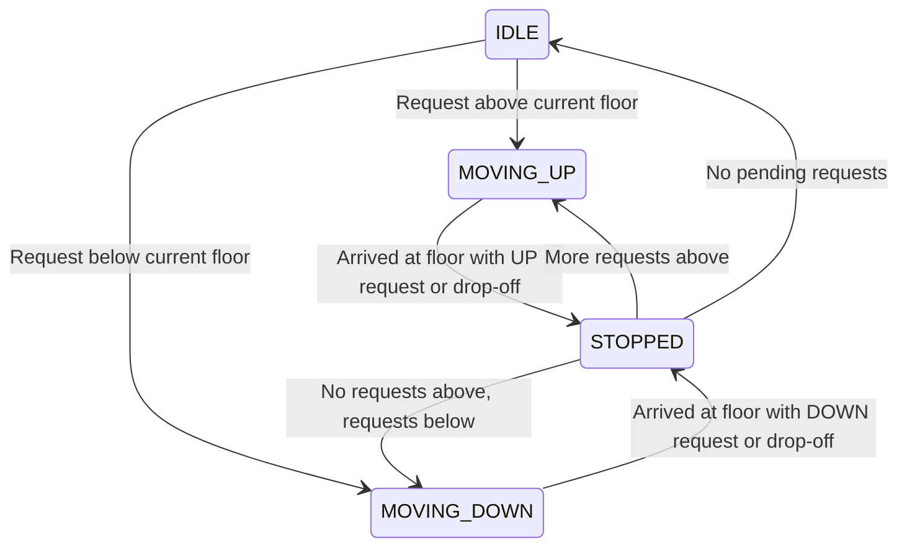

# 🛗 Low-Level Design: Multi-Car Elevator Control System

An elevator system coordinates multiple cars across multiple floors efficiently, minimizing wait times and energy consumption.

---

## 1. System Requirements & Components

1. **Floors & Elevator Cars**: A building has $F$ floors and $C$ elevators.
2. **Requests**:
   - **External Request**: A user on floor $X$ presses `UP` or `DOWN`.
   - **Internal Request**: A user inside elevator $E$ presses destination floor $Y$.
3. **Dispatch Strategy**:
   - **LOOK / SCAN Algorithm**: Car continues moving in its current direction serving pending requests until no more requests exist in that direction, then reverses.
4. **Safety & Capacity**: Each car has a maximum weight capacity and door obstruction sensors.

---

## 2. State Machine & Scheduling



---

## 3. Python Implementation (LOOK Algorithm)

```python
from enum import Enum
import heapq

class Direction(Enum):
    UP = 1
    DOWN = -1
    IDLE = 0

class ElevatorState(Enum):
    MOVING = "MOVING"
    STOPPED = "STOPPED"
    IDLE = "IDLE"

class ElevatorCar:
    def __init__(self, car_id: int):
        self.car_id = car_id
        self.current_floor = 1
        self.direction = Direction.IDLE
        self.state = ElevatorState.IDLE
        
        # Look algorithm: min-heap for floors above, max-heap for floors below
        self.up_stops: list[int] = []    # min-heap
        self.down_stops: list[int] = []  # max-heap (negated values)

    def add_destination(self, target_floor: int):
        if target_floor > self.current_floor:
            if target_floor not in self.up_stops:
                heapq.heappush(self.up_stops, target_floor)
        elif target_floor < self.current_floor:
            neg_floor = -target_floor
            if neg_floor not in self.down_stops:
                heapq.heappush(self.down_stops, neg_floor)

        if self.direction == Direction.IDLE:
            self.direction = Direction.UP if self.up_stops else Direction.DOWN

    def step(self):
        """Simulates one tick of movement for the elevator car."""
        if self.direction == Direction.UP:
            if self.up_stops:
                next_floor = self.up_stops[0]
                self.current_floor += 1
                if self.current_floor == next_floor:
                    heapq.heappop(self.up_stops)
                    print(f"[Car {self.car_id}] Stopped at Floor {self.current_floor} (Doors Open)")
            else:
                self.direction = Direction.DOWN if self.down_stops else Direction.IDLE

        elif self.direction == Direction.DOWN:
            if self.down_stops:
                next_floor = -self.down_stops[0]
                self.current_floor -= 1
                if self.current_floor == next_floor:
                    heapq.heappop(self.down_stops)
                    print(f"[Car {self.car_id}] Stopped at Floor {self.current_floor} (Doors Open)")
            else:
                self.direction = Direction.UP if self.up_stops else Direction.IDLE

class ElevatorController:
    def __init__(self, cars: list[ElevatorCar]):
        self.cars = cars

    def request_pickup(self, floor: int, direction: Direction):
        """Assigns the best elevator using proximity and direction matching."""
        best_car = None
        min_distance = float('inf')

        for car in self.cars:
            dist = abs(car.current_floor - floor)
            # Bonus score if car is already moving towards the request
            is_towards = (car.direction == direction and 
                          ((direction == Direction.UP and car.current_floor <= floor) or
                           (direction == Direction.DOWN and car.current_floor >= floor)))
            
            effective_dist = dist if is_towards else dist + 10
            if effective_dist < min_distance:
                min_distance = effective_dist
                best_car = car

        if best_car:
            print(f"Assigning Car {best_car.car_id} to Floor {floor}")
            best_car.add_destination(floor)
```
