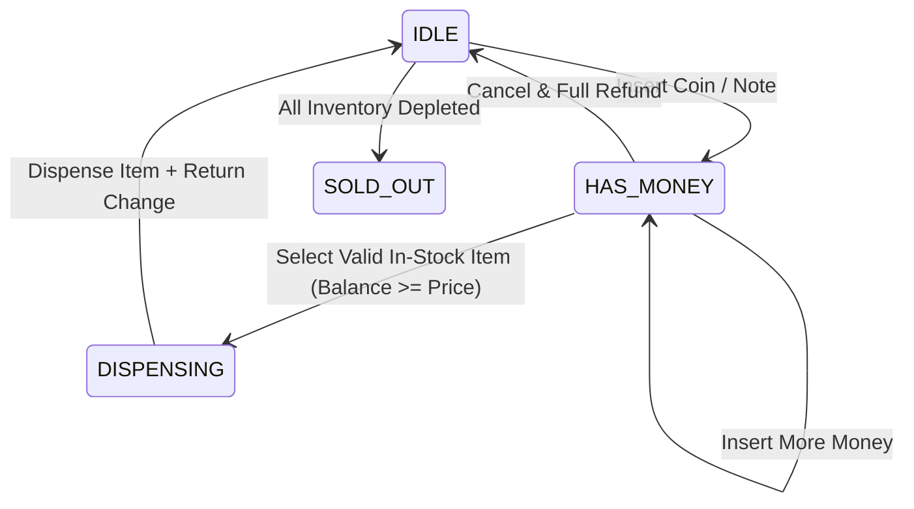

# 🍫 Low-Level Design: State-Driven Vending Machine

A favorite machine coding problem testing the **State Design Pattern**, inventory accounting, and currency calculation.

---

## 1. Problem Statement
* A vending machine holds multiple products with different codes, prices, and stock counts.
* Accepts multiple denominations of coins/bills (e.g. 1, 5, 10, 25 cents, $1, $5).
* States: `IDLE`, `HAS_MONEY`, `DISPENSING`, `SOLD_OUT`.
* Calculates and dispenses accurate change.
* Allows user cancellation with a full refund prior to dispensing.

---

## 2. State Machine Diagram



---

## 3. Python Implementation

```python
from abc import ABC, abstractmethod
from typing import Optional

class Item:
    def __init__(self, code: str, name: str, price: float, count: int):
        self.code = code
        self.name = name
        self.price = price
        self.count = count

class VendingMachineState(ABC):
    @abstractmethod
    def insert_money(self, machine: "VendingMachine", amount: float): pass
    @abstractmethod
    def select_item(self, machine: "VendingMachine", code: str): pass
    @abstractmethod
    def dispense(self, machine: "VendingMachine"): pass
    @abstractmethod
    def cancel_transaction(self, machine: "VendingMachine"): pass

class IdleState(VendingMachineState):
    def insert_money(self, machine: "VendingMachine", amount: float):
        machine.current_balance += amount
        print(f"💰 Inserted ${amount:.2f}. Total Balance: ${machine.current_balance:.2f}")
        machine.set_state(machine.has_money_state)

    def select_item(self, machine: "VendingMachine", code: str):
        print("⚠️ Please insert money first.")

    def dispense(self, machine: "VendingMachine"):
        print("⚠️ No item selected.")

    def cancel_transaction(self, machine: "VendingMachine"):
        print("⚠️ No transaction in progress.")

class HasMoneyState(VendingMachineState):
    def insert_money(self, machine: "VendingMachine", amount: float):
        machine.current_balance += amount
        print(f"💰 Inserted ${amount:.2f}. Total Balance: ${machine.current_balance:.2f}")

    def select_item(self, machine: "VendingMachine", code: str):
        item = machine.inventory.get(code)
        if not item:
            print("❌ Invalid item code.")
            return
        if item.count <= 0:
            print(f"❌ {item.name} is Sold Out!")
            return
        if machine.current_balance < item.price:
            deficit = item.price - machine.current_balance
            print(f"❌ Insufficient funds. Please insert ${deficit:.2f} more.")
            return

        machine.selected_item = item
        machine.set_state(machine.dispense_state)
        machine.dispense()

    def dispense(self, machine: "VendingMachine"):
        print("⚠️ Select an item before dispensing.")

    def cancel_transaction(self, machine: "VendingMachine"):
        refund = machine.current_balance
        machine.current_balance = 0.0
        print(f"🔄 Transaction cancelled. Refunded: ${refund:.2f}")
        machine.set_state(machine.idle_state)

class DispenseState(VendingMachineState):
    def insert_money(self, machine: "VendingMachine", amount: float):
        print("⚠️ Dispensing in progress. Cannot insert money.")

    def select_item(self, machine: "VendingMachine", code: str):
        print("⚠️ Dispensing in progress. Cannot select item.")

    def dispense(self, machine: "VendingMachine"):
        item = machine.selected_item
        item.count -= 1
        change = round(machine.current_balance - item.price, 2)
        machine.current_balance = 0.0
        machine.selected_item = None
        
        print(f"🎉 Dispensed {item.name}!")
        if change > 0:
            print(f"💵 Returned Change: ${change:.2f}")
        
        machine.set_state(machine.idle_state)

    def cancel_transaction(self, machine: "VendingMachine"):
        print("⚠️ Cannot cancel while dispensing.")

class VendingMachine:
    def __init__(self):
        self.idle_state = IdleState()
        self.has_money_state = HasMoneyState()
        self.dispense_state = DispenseState()
        
        self.current_state: VendingMachineState = self.idle_state
        self.current_balance = 0.0
        self.selected_item: Optional[Item] = None
        self.inventory: dict[str, Item] = {}

    def set_state(self, state: VendingMachineState):
        self.current_state = state

    def add_item(self, item: Item):
        self.inventory[item.code] = item

    def insert_money(self, amount: float): self.current_state.insert_money(self, amount)
    def select_item(self, code: str): self.current_state.select_item(self, code)
    def dispense(self): self.current_state.dispense(self)
    def cancel(self): self.current_state.cancel_transaction(self)

# --- Verification ---
if __name__ == "__main__":
    vm = VendingMachine()
    vm.add_item(Item("A1", "Snickers", 1.50, 5))
    vm.add_item(Item("B2", "Coca-Cola", 2.00, 2))

    vm.insert_money(1.00)
    vm.select_item("A1")  # Fails: Needs $0.50 more
    vm.insert_money(1.00)  # Total: $2.00
    vm.select_item("A1")  # Dispenses Snickers, returns $0.50 change
```
