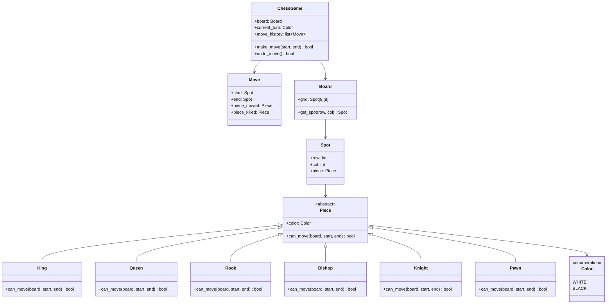

# ♟️ Low-Level Design: Chess Game Engine

A comprehensive object-oriented chess model incorporating piece inheritance, move validation, turn switching, and move history via the Command pattern.

---

## 1. Class Diagram



---

## 2. Python Implementation

```python
from abc import ABC, abstractmethod
from enum import Enum
from typing import Optional

class Color(Enum):
    WHITE = 1
    BLACK = 2

class Piece(ABC):
    def __init__(self, color: Color):
        self.color = color

    @abstractmethod
    def can_move(self, board: "Board", start: "Spot", end: "Spot") -> bool:
        pass

class Knight(Piece):
    def can_move(self, board: "Board", start: "Spot", end: "Spot") -> bool:
        if end.piece and end.piece.color == self.color:
            return False  # Cannot capture own piece
        
        dr = abs(start.row - end.row)
        dc = abs(start.col - end.col)
        # L-shape: (2, 1) or (1, 2)
        return (dr == 1 and dc == 2) or (dr == 2 and dc == 1)

class Rook(Piece):
    def can_move(self, board: "Board", start: "Spot", end: "Spot") -> bool:
        if end.piece and end.piece.color == self.color:
            return False
        
        if start.row != end.row and start.col != end.col:
            return False  # Must be strictly horizontal or vertical

        # Check path clearance
        r_step = 0 if start.row == end.row else (1 if end.row > start.row else -1)
        c_step = 0 if start.col == end.col else (1 if end.col > start.col else -1)

        curr_r = start.row + r_step
        curr_c = start.col + c_step
        while (curr_r, curr_c) != (end.row, end.col):
            if board.get_spot(curr_r, curr_c).piece is not None:
                return False  # Obstacle in path
            curr_r += r_step
            curr_c += c_step

        return True

class Spot:
    def __init__(self, row: int, col: int, piece: Optional[Piece] = None):
        self.row = row
        self.col = col
        self.piece = piece

class Move:
    def __init__(self, start: Spot, end: Spot):
        self.start = start
        self.end = end
        self.piece_moved = start.piece
        self.piece_killed = end.piece

    def execute(self):
        self.end.piece = self.piece_moved
        self.start.piece = None

    def undo(self):
        self.start.piece = self.piece_moved
        self.end.piece = self.piece_killed

class Board:
    def __init__(self):
        self.grid = [[Spot(r, c) for c in range(8)] for r in range(8)]

    def get_spot(self, row: int, col: int) -> Spot:
        return self.grid[row][col]

class ChessGame:
    def __init__(self):
        self.board = Board()
        self.current_turn = Color.WHITE
        self.move_history: list[Move] = []
        self._setup_pieces()

    def _setup_pieces(self):
        # White pieces on row 0 & 1, Black on 7 & 6
        self.board.get_spot(0, 1).piece = Knight(Color.WHITE)
        self.board.get_spot(0, 6).piece = Knight(Color.WHITE)
        self.board.get_spot(0, 0).piece = Rook(Color.WHITE)
        self.board.get_spot(7, 1).piece = Knight(Color.BLACK)
        self.board.get_spot(7, 0).piece = Rook(Color.BLACK)

    def player_move(self, start_pos: tuple[int, int], end_pos: tuple[int, int]) -> bool:
        start_spot = self.board.get_spot(*start_pos)
        end_spot = self.board.get_spot(*end_pos)

        piece = start_spot.piece
        if not piece:
            print("❌ No piece at start position.")
            return False
        if piece.color != self.current_turn:
            print("❌ Not your turn!")
            return False

        if not piece.can_move(self.board, start_spot, end_spot):
            print("❌ Invalid move for this piece.")
            return False

        move = Move(start_spot, end_spot)
        move.execute()
        self.move_history.append(move)
        
        # Switch turn
        self.current_turn = Color.BLACK if self.current_turn == Color.WHITE else Color.WHITE
        print(f"✅ Move executed: ({start_pos}) -> ({end_pos})")
        return True

    def undo(self) -> bool:
        if not self.move_history:
            return False
        last_move = self.move_history.pop()
        last_move.undo()
        self.current_turn = Color.BLACK if self.current_turn == Color.WHITE else Color.WHITE
        print("🔄 Move undone.")
        return True
```
