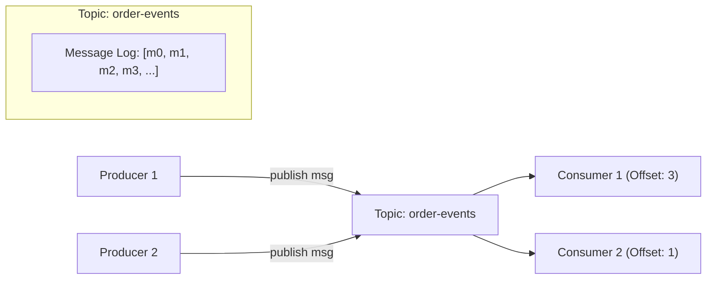

# 📬 Low-Level Design: In-Memory Pub/Sub Messaging Queue (Mini-Kafka)

A multi-threaded in-memory publish-subscribe message broker supporting topics, independent consumer offset tracking, and concurrent message consumption.

---

## 1. System Requirements & Architecture



1. **Topics**: Named channels to which messages are published.
2. **Append-Only Log**: Each topic stores messages sequentially in a list.
3. **Independent Offsets**: Each subscriber tracks its own read position (`offset`), allowing slow consumers to process at their own pace without blocking others.
4. **Thread Safety**: Concurrent producers can safely publish without race conditions or torn writes.

---

## 2. Python Implementation

```python
import threading
import time
from typing import Callable, Optional

class Message:
    def __init__(self, message_id: str, payload: str):
        self.message_id = message_id
        self.payload = payload
        self.timestamp = time.time()

class ISubscriber:
    def __init__(self, subscriber_id: str):
        self.subscriber_id = subscriber_id

    def on_message(self, message: Message):
        raise NotImplementedError

class TopicSubscriber:
    def __init__(self, subscriber: ISubscriber):
        self.subscriber = subscriber
        self.offset = 0
        self.lock = threading.Lock()

class Topic:
    def __init__(self, name: str):
        self.name = name
        self.messages: list[Message] = []
        self.subscribers: list[TopicSubscriber] = []
        self.lock = threading.Lock()
        self.condition = threading.Condition(self.lock)

    def add_subscriber(self, subscriber: ISubscriber):
        with self.lock:
            self.subscribers.append(TopicSubscriber(subscriber))

    def publish(self, message: Message):
        with self.lock:
            self.messages.append(message)
            # Wake up any consumer worker threads waiting for new messages
            self.condition.notify_all()
            print(f"📢 [Topic: {self.name}] Published msg: {message.payload}")

    def poll_messages(self, topic_sub: TopicSubscriber) -> list[Message]:
        with self.lock:
            if topic_sub.offset >= len(self.messages):
                return []
            
            unread = self.messages[topic_sub.offset:]
            topic_sub.offset = len(self.messages)
            return unread

class PubSubBroker:
    def __init__(self):
        self.topics: dict[str, Topic] = {}
        self.lock = threading.Lock()

    def create_topic(self, topic_name: str) -> Topic:
        with self.lock:
            if topic_name not in self.topics:
                self.topics[topic_name] = Topic(topic_name)
            return self.topics[topic_name]

    def subscribe(self, topic_name: str, subscriber: ISubscriber):
        with self.lock:
            if topic_name not in self.topics:
                raise ValueError(f"Topic {topic_name} does not exist")
            self.topics[topic_name].add_subscriber(subscriber)

    def publish(self, topic_name: str, message: Message):
        topic = self.topics.get(topic_name)
        if not topic:
            raise ValueError(f"Topic {topic_name} does not exist")
        topic.publish(message)

# --- Concrete Subscriber Example ---
class EmailNotificationSubscriber(ISubscriber):
    def on_message(self, message: Message):
        print(f"📧 [Email Worker] Processed: {message.payload}")

class AnalyticsSubscriber(ISubscriber):
    def on_message(self, message: Message):
        print(f"📊 [Analytics Worker] Logged: {message.payload}")
```
